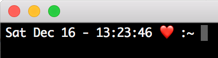

Want to customize the terminal prompt on your Mac? Here's how: 

- open a terminal window and type: `sudo nano .bash_profile` 
- add a custom prompt to your .bash_profile: `export PS1=" "`
- next, insert the variables or text that you want to see in between the quote marks
  - for example: `export PS1="\d - \t ❤️  :~ "` will look like this...
   
  
      
  - note that you can use emoticons also; I like this because it helps to break up the terminal for me.

Some common variables that you can play with include: 

- \d – Current date
- \t – Current time
- \h – Host name
- \# – Command number
- \u – User name
- \W – Current working directory (ie: Desktop/)
- \w – Current working directory with full path (ie: /Users/Admin/Desktop/)

